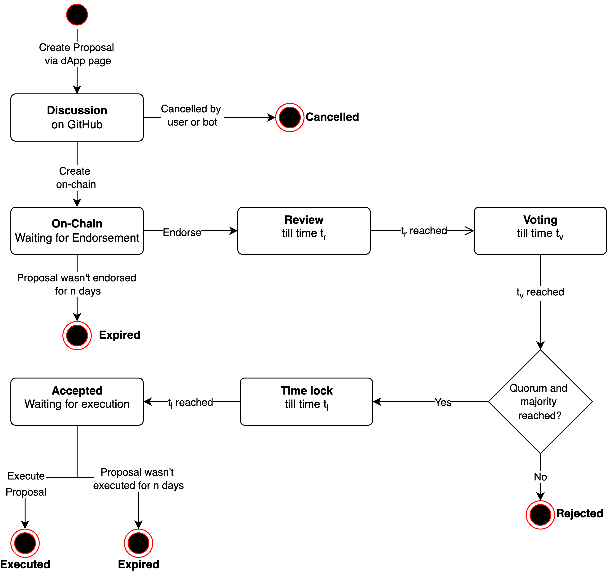

---
---

# Introduction

This part describes the technical materialisation of the GrantShares program in the form of a governance dApp.

The technical implementation of GrantShares consists of four parts:
- Smart contracts
- GitHub issues
- Web Frontend
- Backend

 that allows users to submit, discuss, view, endorse, vote on, and execute proposals. 
(smart contracts + web page + GitHub issues) 
Each proposal leads to pre-determined actions that are executed on-chain if approved. Discussion on proposals takes place via GitHub issues. 

The GrantShares Governance dApp has the following properties:

- GrantShares is permissioned. Membership requires a proposal and, therefore, approval of the existing members. Voting rights cannot be bought. There is no token involved in membership.
- Each member has equal voting power, i.e., one vote per member per proposal.
- The GrantShares treasury contract owns the assets used for grants.
- The treasury can only receive funding from addresses that were previously whitelisted via a proposal.
- The treasury can only receive tokens that were previously whitelisted via a proposal.
- Proposals are generic, they can include any intents that are executable on-chain.

## Proposals

A "Proposal" is an instrument with which anyone can suggest on-chain changes by invocation of smart contract methods that the DAO has authority over.

Technically speaking, a Proposal $p$ is a set of method calls $X$ with parameters $Y$ on smart contracts $Z$. If the DAO Members approve of $p$, then the DAO smart contract will execute it, i.e., calls methods $X$ with params $Y$ on the smart contracts $Z$.

***Anyone can create a proposal via the dApp or directly on-chain.***

### Proposal Phases & States

A proposal goes through the following life cycle, which are also depicted in the state diagram below.

- **Discussion**
The proposal was created via the dApp web page and is open for discussion. The discussion takes place on a GitHub issue, which is automatically created for the proposal (by the GrantShares bot).
- **Cancelled**
The proposal was cancelled by the creator or the GrantShares bot (in-case of inactivity) before it was put on-chain. The GitHub issue is closed.
- **On-Chain**
A proposal under discussion is created on the Neo blockchain, i.e., on the GrantShares contract. At this point, the proposal has to wait for the endorsement of a member before the rest of its life cycle begins.
- **Expired**
If the proposal isn't endorsed for a defined time period it expires. The period is defined by a contract parameter. After it is expired it can no longer be endorsed and becomes useless. The corresponding GitHub issue is closed by the bot.
- **Review**
The first phase of a proposal on-chain is the review phase. It allows the members to form an opinion on it before voting starts. Voting is not possible in this phase. Because discussion already takes place before the proposal is created on-chain this phase will probably be set to zero length.
- **Voting** 
The proposal is active and open for voting by the members.
- **Rejected**
If, after voting, the proposal didn't reach the quorum or the majority it goes into the Rejected state.
- **Time lock** 
If the proposal was approved it goes into a time lock state before it can be executed. This phase exists for security. Such, that if something is deemed to be wrong with the proposal, GrantShares members could still react and pause the contract.
- **Accepted**
After the time lock phase the proposal is in the Accepted state and can be executed. Execution requires an invocation from outside of the contract.
- **Expired**
If the proposal isn't executed for a defined time period it expires. The period is defined by a contract parameter. After it is expired it can no longer be executed even if it was accepted.
- **Executed**
Once executed, the proposal has reached the end of its lifecycle.

